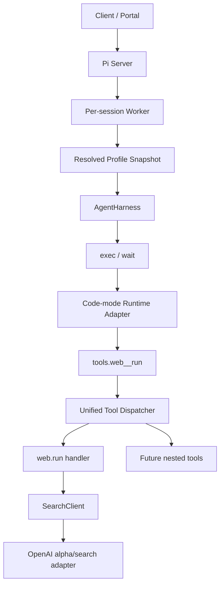

# 多 Profile 单 AgentHarness + Codex 工具不变量（修订实施方案）

> 目标项目：`/Users/roycheung/Documents/work/pi/`（Pi Agent Harness，TypeScript monorepo）
> 研究来源：`/Users/roycheung/Documents/work/codex/docs/note/`
> 状态：已完成架构评审；M0 技术 Spike 通过后进入正式实施

---

## 一、目标与基调

在自有云端 Agent Harness（Pi）上复用 Codex/ChatGPT harness 的核心设计理念：

> **快速问答与复杂任务不是两套 agent loop，而是同一个 AgentHarness 在不同 Profile、工具曝光方式和执行环境下的运行档位。**

采用多套 Profile + 一个 AgentHarness。Profile 是版本化配置，不产生新的 loop 分支。会话创建时选择 Profile，会话内保持不变；恢复时继续使用创建时的 Profile 快照。

本阶段以 Codex 的 `exec`、`wait` 和 `web.run` 作为**实验工具不变量**，用于隔离并比较 Profile、prompt 和 reasoning 配置的影响。“不变量”指模型可见协议、参数、输出语义和生命周期尽量一致，不要求 TypeScript 实现与 Rust 内部结构相同。

实验配置与生产配置可以使用不同的权限和资源上限，但本方案中的搜索调用链保持不变：

| 配置 | 用途 | 工具策略 |
|---|---|---|
| `comparison-quick` / `comparison-task` | A/B 对比 Profile 差异 | 顶层仅暴露 exec/wait；搜索只能由 exec 内的 `tools.web__run()` 发起 |
| `production-quick` | 快速搜索问答 | 同一 exec 嵌套搜索路径，使用更低 reasoning 和更严格执行限额 |
| `production-task` | 多步骤与制品任务 | 同一 exec 嵌套搜索路径，使用更高 reasoning，并按策略增加后续制品工具 |

`SearchClient` 不是提供给模型的新工具，也不是绕过 code mode 的快捷路径。它只是 `web.run` handler 用来访问具体搜索后端的内部端口。

---

## 二、设计决策

| # | 决策 | 取值 |
|---|---|---|
| 1 | Agent loop | 复用一个 `AgentHarness`，不复制驱动、压缩、恢复或工具循环 |
| 2 | Profile 生命周期 | 会话创建时解析并持久化版本化快照；会话内不切换 |
| 3 | Profile 边界 | `LaneConfiguration` 是每轮执行快照；完整 Profile 另含 prompt、skills、工具策略和 runtime 版本 |
| 4 | 工具不变量 | 对齐 exec/wait/web.run 的协议表面；实现通过 Pi 的统一分发与持久化机制完成 |
| 5 | 工具曝光 | 实验 Profile 顶层只暴露 exec/wait；web.run 只能由 exec 内的 `tools.web__run()` 嵌套调用 |
| 6 | JS 运行时 | `isolated-vm` 是候选适配器，必须先通过 M0；运行在独立子进程，不进入通用 core 的默认依赖图 |
| 7 | Cell 语义 | Promise/显式 yield 边界支持协作式挂起；同步 CPU 超时终止，不宣称可无损恢复执行栈 |
| 8 | 搜索后端 | web.run handler 依赖 provider-neutral `SearchClient`；`SearchClient` 不进入模型工具面，`alpha/search` 只是其实验适配器 |
| 9 | 落地路径 | experimental session worker；不碰 legacy `AgentSession` / TUI |
| 10 | PPT 验收 | 后移至 Artifact Runtime 阶段；本阶段不以 PPT 生成证明 code mode 完成 |

---

## 三、Pi 现状与缺口

### 3.1 可直接复用

- `LaneConfiguration = { model, thinkingLevel, activeToolNames }` 已持久化，并在每轮边界写入 `GenerationContext`，适合作为 Profile 的执行三元组。
- `Tool.constrainedSampling` 已支持 `openai_lark`；OpenAI Responses 可把单字符串参数工具序列化为 custom grammar tool。
- AgentHarness 已具备 tools、resources、systemPrompt、toolContext、hooks、事件、durable invocation memo 和恢复流程。
- experimental server 已采用 server 路由 + per-session worker 私有持有 Harness 的边界，适合承载会话隔离。
- `Models.getAuth()` 可解析 provider/model 对应的认证、headers 和 base URL。

### 3.2 必须补齐

1. Profile 快照及其在 session-worker 启动、重启、恢复过程中的传播。
2. “code mode 内可调用工具”与“模型顶层可见工具”的分离；当前 `activeToolNames` 同时承担两种职责。
3. 顶层和 code-mode 嵌套调用共用的工具分发抽象。
4. code-mode runtime 与 cell 生命周期。
5. provider-neutral 搜索接口及 OpenAI `alpha/search` 实验适配器。
6. 后续 Artifact Runtime 所需的附件、文件、发布、镜像和验证能力。

### 3.3 已修正的假设

- `isolated-vm` 的 timeout 是取消执行，不是暂停后恢复，不能直接等价于 Codex 的 `PauseUntilResumed`。
- Pi 当前没有可由 code mode 直接复用的公开 ToolRouter；嵌套调用不能绕过 drive 的 gate、hook、memo、checkpoint 和恢复语义。
- `LaneConfiguration` 不包含 system prompt、skills 或 runtime 版本，不能单独代表完整 Profile。
- Pi 工具只有一个 `name` 字段，没有原生 namespace；必须定义显式工具身份映射。
- 未接入 Artifact Runtime 前，`exec`/`wait`/`web.run` 不能完成真实 PPT 交付。

---

## 四、目标架构与包边界



| 层 | 责任 | 建议位置 |
|---|---|---|
| Agent core | Profile 快照引用、工具曝光策略、统一分发生命周期接口 | `packages/agent/src/harness/` |
| Code-mode 协议 | grammar、描述构造、cell 状态与输出格式 | `packages/agent/src/harness/code-mode/`，不得依赖 Node/native 模块 |
| Node runtime adapter | `isolated-vm`、进程隔离、内存/CPU 限额 | `packages/coding-agent/src/experimental/code-mode/`；成熟后可拆独立包 |
| Search contract | `SearchClient`、中立请求/响应类型 | experimental 应用层，稳定后再决定是否下沉 |
| OpenAI search adapter | OAuth、JWT account id、URL、HTTP | `packages/coding-agent/src/experimental/search/` |
| Profile registry | quick/task 定义、prompt、skills、版本 | `packages/coding-agent/src/experimental/profiles.ts` |

`@earendil-works/pi-agent-core` 不直接依赖 `isolated-vm`，也不包含 OpenAI 私有端点认证逻辑，避免破坏浏览器和其他运行时的依赖边界。

---

## 五、Profile 与持久化

### 5.1 定义

Profile 分为注册定义和会话快照：

```ts
interface AgentProfileDefinition {
  id: string;
  version: string;
  configuration: LaneConfiguration;
  codeModeToolIds: string[];
  skills: Skill[];
  buildSystemPrompt(context: ProfileBuildContext): string | Promise<string>;
  runtimeVersion: string;
}

interface AgentProfileSnapshot {
  id: string;
  version: string;
  configuration: LaneConfiguration;
  codeModeToolIds: string[];
  resolvedSystemPrompt: string;
  systemPromptHash: string;
  skillVersions: Record<string, string>;
  toolsetVersion: string;
  runtimeVersion: string;
}
```

### 5.2 规则

- 新会话：解析 Profile，生成快照并持久化；worker 使用该快照创建 Harness。
- 恢复会话：加载原快照，不重新套用当前同名 Profile。
- 快照引用的工具或 runtime 不可用时明确失败，不静默换版本。
- `LaneConfiguration` 继续负责每轮原子配置；Profile 快照负责跨 worker/部署重现。
- 本期不支持会话内 Profile 切换，因此不把通用 `applyConfiguration()` 作为前置条件。后续确需切换时，再增加原子 API 与单一 configuration event。

### 5.3 Profile 档位

- `comparison-quick`：低 thinking、精简 prompt；顶层仅 exec/wait，code mode 内提供 web.run。
- `comparison-task`：高 thinking、完整任务 prompt；使用完全相同的顶层及嵌套工具面。
- `production-quick`：保留相同调用链，通过更低 thinking、prompt 和 runtime 限额获得低延迟，不增加直连搜索工具。
- `production-task`：保留相同调用链，通过更高 thinking、skills 和后续制品工具支持复杂任务。

因此 quick 与 task 的实验差异不包含“是否经过 exec”。即使问题只需要一次搜索，模型也必须生成 exec 代码并调用 `tools.web__run()`；这是本实验要保持的 Codex harness 不变量。

Profile 使用前校验模型能力。需要 grammar custom tool 的 Profile 遇到不支持该能力的模型时必须拒绝启动，不能静默退化成普通 function tool。

---

## 六、工具身份、曝光与统一分发

### 6.1 工具身份

Pi 当前没有 namespace，新增应用层身份描述：

```ts
interface ToolIdentity {
  id: string;            // 稳定逻辑 ID，例如 "web.run"
  codeModeName: string;  // JS tools 名，例如 "web__run"
}
```

启动时验证逻辑 ID 和 code-mode 名分别无冲突。`activeToolNames` 对这些实验 Profile 固定为 `exec`、`wait`；嵌套调用根据 `codeModeName -> id` 映射解析，再检查 `codeModeToolIds`。

code-mode-only 配置下：

- 顶层模型可见：`exec`、`wait`。
- code-mode registry 可调用：`web.run` 等允许的嵌套工具。
- `tools.web__run()` 解析到逻辑 ID `web.run`。
- `exec` 与 `wait` 禁止递归调用自身或彼此制造无界 cell 链。

### 6.2 统一 ToolDispatcher

不能从 isolate 直接调用 `tool.execute()`。先从 Pi 现有工具执行流程抽取统一 dispatcher，使顶层和嵌套调用共享：

- 参数准备与 schema 校验
- `before_tool` / `after_tool` hooks
- effect gate 与取消信号
- toolContext 解析
- invocation memo 与进度 checkpoint
- 结果规范化、usage 和审计事件
- allowlist、递归深度和并发限制

顶层调用仍进入正常 transcript。嵌套调用记录在父 `exec` invocation 的 durable memo/checkpoint 和审计事件中，结果只返回对应 JS Promise，不伪造成新的顶层 assistant tool call。

嵌套调用默认并发，但受每个 cell 和 session 的上限控制；标记为 sequential 的工具使所在嵌套批次串行。

---

## 七、Code-mode Runtime

### 7.1 M0 技术 Spike

在正式实现前，用独立临时包验证 `isolated-vm`：

1. Node 22/macOS/Linux 的安装、预编译产物与 `--no-node-snapshot` 启动要求。
2. Promise 跨 isolate 桥接，异步 host callback 回填结果。
3. 保留 isolate/context/pending evaluation 后，由 `wait` 继续观察。
4. `yield_control()` 的协作式挂起与恢复。
5. 同步死循环的 timeout、终止与资源清理。
6. memoryLimit 不是严格安全边界；catastrophic error 必须只杀 runtime 子进程。
7. worker 退出、Harness 关闭和会话回收时释放所有 cell。

若 Spike 无法稳定实现 Promise/yield 语义，则停止引入 `isolated-vm`，评估独立 V8 worker 服务或其他 runtime；不以重放脚本伪装为恢复。

### 7.2 Runtime 接口

```ts
interface CodeModeRuntime {
  execute(request: ExecuteCellRequest, context: RuntimeContext): Promise<CellObservation>;
  observe(cellId: string, cursor: number, signal: AbortSignal): Promise<CellObservation>;
  terminate(cellId: string): Promise<void>;
  dispose(): Promise<void>;
}
```

Core 协议定义 exec lark grammar、描述构造、cell 状态、增量游标、输出项、`store`/`load`、媒体/notify 事件、嵌套调用事件和输出截断。Node adapter 负责 V8 与进程生命周期。

### 7.3 Cell 语义

- `exec` 启动 cell，并观察到完成、失败、显式 yield 或观察窗口到期。
- Promise 等待或显式 `yield_control()` 时保留 cell，由 `wait` 继续观察新输出。
- 同步 CPU 执行超过硬上限时终止 cell，返回 timeout/failed；不声称可恢复。
- `wait` 只返回上次游标后的新输出；完成、失败或 terminate 后关闭 cell。
- 未 await 的 Promise 在顶层脚本完成后取消或丢弃，并释放关联 dispatcher 调用。
- 每个 session/cell 设置数量、内存、CPU、墙钟、输出 token、嵌套深度和并发上限。

兼容性分两档：

| 档位 | 要求 |
|---|---|
| 协议兼容 | 工具 schema、描述、状态文本、输出格式和命名规则与 Codex 对齐 |
| 行为兼容 | Promise/显式 yield、wait 增量输出、terminate、嵌套调用和清理行为通过契约测试 |

不把无法实现的任意 V8 执行栈暂停纳入行为兼容承诺。

---

## 八、SearchClient 与 web.run

### 8.1 中立接口

```ts
interface SearchClient {
  run(request: SearchRequest, context: SearchContext): Promise<SearchResponse>;
}
```

`SearchClient` 只属于 `web.run` handler 的后端依赖，不注册为 AgentHarness tool，也不出现在模型 prompt、顶层 tool schema 或 code-mode `tools` namespace 中。模型只能在 `exec` 代码里调用 `tools.web__run()`；dispatcher 找到 `web.run` handler 后，才由 handler 调用 `SearchClient.run()`。测试默认注入 fake client，不访问真实网络。

固定调用链为：

```text
assistant -> exec(code) -> tools.web__run(commands)
          -> nested ToolDispatcher -> web.run handler
          -> SearchClient -> OpenAIAlphaSearchClient -> alpha/search
```

### 8.2 OpenAI 实验适配器

`OpenAIAlphaSearchClient` 放在 experimental 应用层：

- `openai-codex`：`{baseUrl}/codex/alpha/search`
- `openai`：`{baseUrl}/alpha/search`
- 通过 `Models.getAuth(model)` 获取 token、provider headers 和 base URL
- ChatGPT OAuth 时提取 `chatgpt-account-id`
- 设置 `Authorization`、`originator`、`User-Agent` 和请求 ID
- 请求体与 Codex `SearchRequest` 对齐
- `output` 进入模型工具结果；结构化 `results` 通过明确的 worker service/event 类型发布

不得把 `alpha/search` 当成稳定公共 API。认证失败、404/schema 漂移和功能下线必须返回可诊断错误，并允许后续替换其他 `SearchClient`。

### 8.3 工具协议

- schema 和描述以固定 Codex commit 的符号为基线，不依赖易漂移行号。
- 对齐 `SearchCommands` 的 11 个字段、查询数量、response length 和引用规则。
- 默认测试使用录制后脱敏的 fixture；真实端点测试显式 opt-in，不进入普通 CI。
- `results` 的 out-of-band 类型、订阅和持久化策略必须在 M2 内完成，不能只写“走事件”。

---

## 九、Session Worker 接线

1. Session 创建请求接受 `profileId`；服务端解析成具体版本并写入会话 Profile 快照。
2. `SessionWorkerOptionsSchema` 传递快照引用或完整受界快照，而不是只传可漂移的字符串名称。
3. `SessionWorkerManager` 在启动、发现和替换 worker 时保持同一 Profile 快照。
4. `createCodingAgentHarness` 从快照构造 model、thinkingLevel、可见工具、可调用工具、systemPrompt、skills 和 runtime adapter。
5. 已有会话没有快照时执行一次显式迁移策略；不得默认为当前 `task` 后悄悄改变行为。
6. worker readiness 报告 profile ID/version、toolset/runtime version，供 server 验证和诊断。

---

## 十、Artifact Runtime（后续阶段）

图片转 PPT 不属于本阶段 code-mode 验收。真实制品任务至少需要：

- 附件 ID 到工作目录的 `materialize`
- 受控 `ExecutionEnv` / sandbox
- 固定镜像及 `python-pptx` 等依赖
- slides skill
- 二进制产物 `publish`
- OOXML 验证器：可打开、页数、文本/shape、媒体文件和关键内容

接入这些能力后，再以“图片转可编辑 PPT，且不嵌入原图”作为端到端验收。Profile 快照届时增加 sandbox image digest、artifact toolset version 和 verification plan。

---

## 十一、明确不做

本阶段不做：

- legacy `AgentSession` / TUI 改造
- 会话内 Profile 切换
- ChatGPT 独有 namespace（genui、automations、local.handoff 等）
- 从 `~/.codex/auth.json` 读取认证
- 将 `alpha/search` 固化为通用 Harness API
- 将 `isolated-vm` 当作 OS 沙箱或唯一安全边界
- 在 Artifact Runtime 就绪前宣称 PPT 任务跑通

---

## 十二、验证策略

### M0：Runtime Spike

- 独立进程验证 Promise bridge、显式 yield、wait、terminate、timeout 和 catastrophic exit。
- macOS/Linux、Node 22 至少各完成一次安装与 smoke。
- 明确记录可支持和不可支持的 Codex 行为。

### M1：Profile Snapshot

- 新建、关闭、重启 worker 后 Profile 快照一致。
- 同名 Profile 注册内容改变时，旧会话仍使用原版本或明确失败。
- comparison quick/task 顶层都只看到 exec/wait，并使用相同 code-mode web.run。
- production quick/task 均不能直接调用 web.run 或 SearchClient。

### M2：Search Adapter

- fake `SearchClient` 覆盖 web.run schema、错误和 out-of-band results。
- 脱敏 fixtures 校验请求/响应与固定 Codex 基线一致。
- opt-in live 测试分别覆盖 ChatGPT OAuth 与 API key 路径；不进入普通 CI。
- 集成测试必须从 exec 执行 `tools.web__run()`，并断言不存在模型直连 SearchClient/web.run 的路径。

### M3：Unified Dispatcher

- 顶层和嵌套调用经过相同参数校验、hooks、gate 和 toolContext。
- 嵌套调用遵守 allowlist、递归、并发和取消限制。
- worker 中断后不会盲目重放未知外部副作用。
- 嵌套结果不污染顶层 transcript，但可审计、可恢复。

### M4：Code-mode Contract

- exec completed/failed/timeout/yielded 和 wait completed/terminated/not-found。
- wait 只返回增量输出；输出格式使用 snapshot 测试。
- `store`/`load` 跨 cell；未 await Promise 正确清理。
- `Promise.all([tools.web__run(...), ...])` 产生受限真并发。
- 不支持 grammar custom tool 的模型在启动前失败。

### M5：Artifact Runtime

- 附件 materialize、sandbox、固定镜像、publish 和验证闭环。
- 图片转 PPT 通过 OOXML 验证并生成可下载资产。
- 相同 Profile/runtime/image digest 的重复运行不再现场安装依赖。

每个里程碑完成后运行对应 package 的定向测试；代码改动最终运行 `npm run check`。不默认运行真实付费模型或私有端点测试。

---

## 十三、里程碑与退出条件

| 里程碑 | 内容 | 退出条件 |
|---|---|---|
| M0 | `isolated-vm` 可行性与安全 Spike | 明确协作式挂起边界；失败则选替代 runtime |
| M1 | Profile Snapshot + session-worker 接线 | Profile 可重启恢复；所有 Profile 的搜索都保持 exec 嵌套路径 |
| M2 | SearchClient + `alpha/search` 适配器 | fake/fixture 全通过；live smoke 可选通过 |
| M3 | Unified ToolDispatcher | 顶层与嵌套调用共享生命周期且可恢复 |
| M4 | exec/wait code-mode contract | 协议兼容与行为兼容测试通过 |
| M5 | Artifact Runtime + PPT | 固定镜像内生成、验证并发布可编辑 PPT |

实施顺序允许 M1 与 M2 在 M0 后并行；M3 依赖 M1，M4 依赖 M0 与 M3，M5 依赖 M1 与 M4。

---

## 十四、Codex 基线来源

实施时按固定 commit 和符号定位，不以行号作为唯一依据：

| 内容 | Codex 符号/文件 |
|---|---|
| exec/wait grammar 与描述 | `code-mode-protocol/src/description.rs` 中的模板与构造函数 |
| cell 生命周期 | `code-mode-runtime/src/cell_actor/`、`session_runtime/` |
| 输出格式 | `core/src/tools/code_mode/mod.rs` |
| 嵌套命名与分发 | `tools/src/code_mode.rs`、`core/src/tools/code_mode/delegate.rs` |
| web.run schema 与描述 | `ext/web-search/src/schema.rs`、`web_run_description.md` |
| alpha/search 契约 | `codex-api/src/search.rs`、`endpoint/search.rs`、`ext/web-search/src/tool.rs` |

每次移植先记录基线 commit；后续上游变化通过显式契约 diff 评估，不自动同步。
